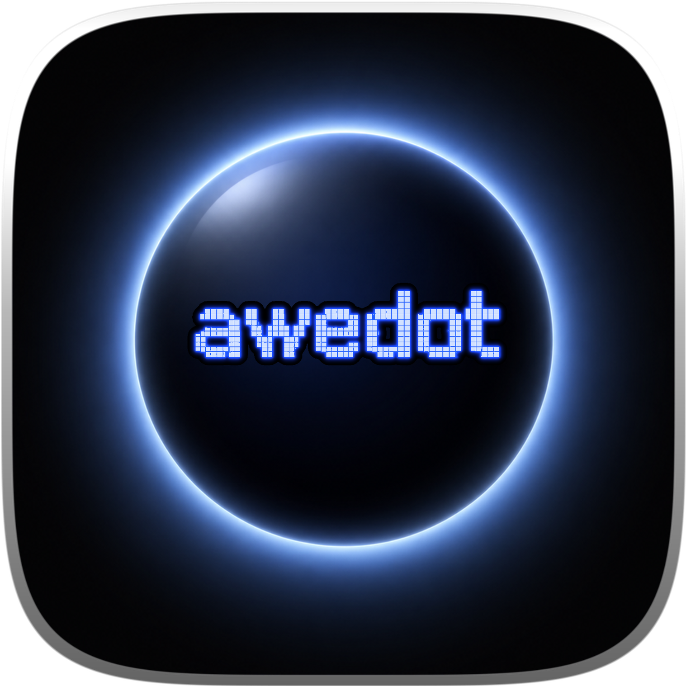

  
  <h1>awedot: AI Session Bookmark Manager for AI Agents</h1>
  
<strong>悬浮球常驻屏幕边缘，一键 bookmark 当前 session，随时 resume 并携带当时的 API profile。</strong>

  

    <a href="./README.md">English</a> ·
    <a href="https://awedot.wehuman.top/">官网</a> ·
    <a href="https://github.com/mugpeng/awedot-Community/discussions">社区讨论</a>
  

  

    
    
    
    
  

## 功能特性

- **一键收藏** — 保存当前 AI session，连同 API profile、项目路径、终端状态一并记录
- **随时恢复** — 点击收藏即可回到上次离开的地方
- **悬浮球** — 非侵入式的状态指示器，常驻屏幕边缘
- **搜索筛选** — 全文搜索、按状态/时间/工具/项目排序、分类过滤

## 下载

最新 `.dmg` 请见 [发行页](https://github.com/mugpeng/awedot/releases)。

> 挂载后请先打开 `/Volumes/awedot/Installation Guide.rtf`，若 macOS 阻止应用启动，按其中步骤操作即可。

## 更新日志

见 [CHANGELOG.md](CHANGELOG.md)。

## 使用方法

1. **安装**：下载 `.dmg`，拖入 Applications 文件夹。首次打开若提示"无法验证开发者"，双击同目录下的 `Fix Gatekeeper` 脚本即可。

2. **悬浮球**：启动后屏幕边缘出现悬浮球，实时显示当前 AI agent 的运行状态（发光点指示）。

3. **展开面板**：点击悬浮球或按快捷键展开面板，查看 **Sessions**（当前活跃会话）和 **Bookmarks**（已收藏的会话）。

4. **Bookmark**：在 Sessions 列表点击收藏按钮，给当前 session 打标签（标题、分类、项目路径、API profile）。

5. **Resume**：点击任意 Bookmark 或 Session，一键恢复该会话到终端，自动携带当时的 API profile 和终端设置。

6. **搜索与筛选**：面板支持全文搜索、按状态/时间/工具/项目排序，以及分类过滤。

## 支持情况

**平台**
- 现已支持：macOS
- 即将推出：Windows · Linux

**Agent**
- 现已支持：Claude Code · Codex
- 即将推出：Gemini CLI · Cursor Agent · Droid · Qoder · Copilot · CodeBuddy · OpenCode
