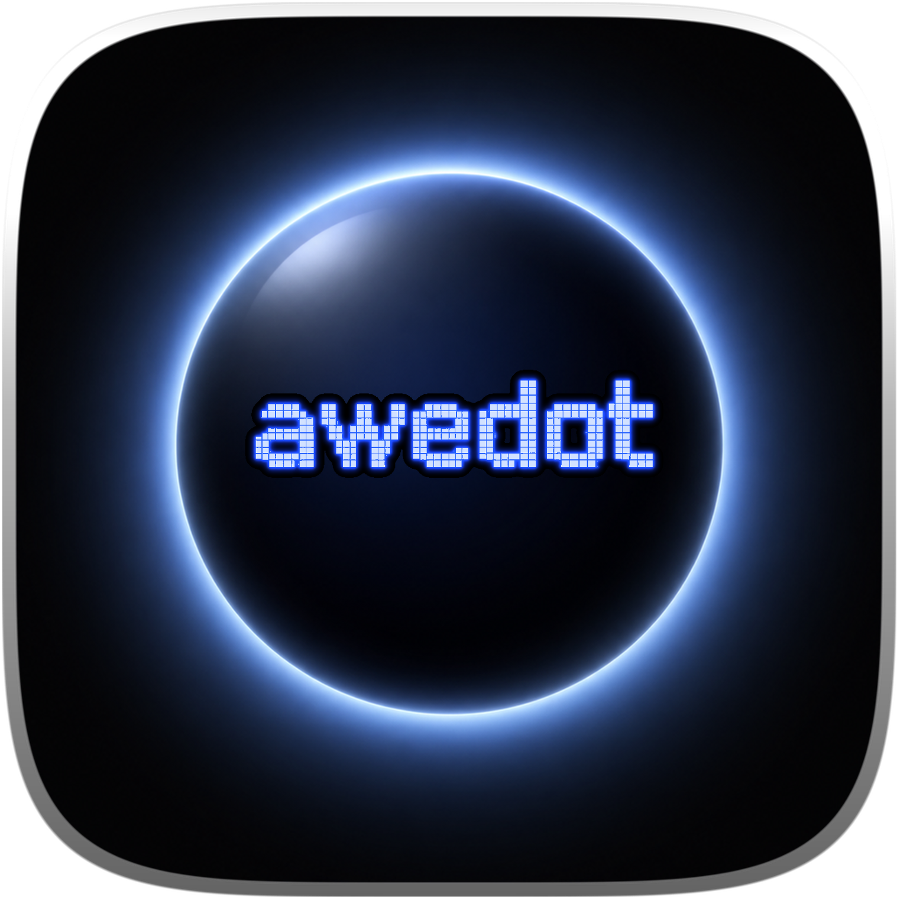

<div align="center">
  
  <h1>awedot: AI Session Bookmark Manager for AI Agents</h1>
  <p><strong>悬浮球常驻屏幕边缘，一键 bookmark 当前 session，随时 resume 并携带当时的 API profile。</strong></p>
  <p>
    <a href="./README.md">English</a> ·
    <a href="https://awedot.wehuman.top/">官网</a> ·
    <a href="#community">社区讨论</a>
  </p>
  <p>
    <a href="https://github.com/mugpeng/awedot"></a>
    <a href="https://github.com/mugpeng/awedot/releases"></a>
    <a href="./LICENSE"></a>
    <a href="https://github.com/mugpeng/awedot"></a>
  </p>
</div>

## 功能特性

| 功能 | 说明 |
|---|---|
| Session 书签 | 一键保存当前 AI session，随时恢复 |
| 分类管理 | 按项目/类别组织书签，快速查找 |
| 实时发现 | 自动扫描本地 Claude Code、Codex 等 agent 的 session |
| 一键 Resume | 在终端恢复 session，自动携带当时的 API profile |
| SSH Remote | 监控远程服务器上的 Claude Code / Codex session |
| 悬浮球形态 | 轻量常驻，不占用工作区，点击即展开 |
| 原生桌面应用 | macOS / Windows（Linux 不支持） |

## 下载

最新 `.dmg` 请见 [发行页](https://github.com/mugpeng/awedot/releases)。

> 挂载后请先打开 `/Volumes/awedot/Installation Guide.rtf`，若 macOS 阻止应用启动，按其中步骤操作即可。

## 更新日志

见 [CHANGELOG.md](CHANGELOG.md)。

## 使用方法

1. **安装**：下载 `.dmg`，拖入 Applications 文件夹。首次打开若提示"无法验证开发者"，双击同目录下的 `Fix Gatekeeper` 脚本即可。

2. **悬浮球**：启动后屏幕边缘出现悬浮球，实时显示当前 AI agent 的运行状态（发光点指示）。

3. **展开面板**：点击悬浮球或按快捷键展开面板，查看 **Sessions**（当前活跃会话）和 **Bookmarks**（已收藏的会话）。

4. **Bookmark**：在 Sessions 列表点击收藏按钮，给当前 session 打标签（标题、分类、项目路径、API profile）。

5. **Resume**：点击任意 Bookmark 或 Session，一键恢复该会话到终端，自动携带当时的 API profile 和终端设置。

6. **搜索与筛选**：面板支持全文搜索、按状态/时间/工具/项目排序，以及分类过滤。

7. **SSH Remote**：打开 Settings → Remote Servers，填入 name / host / user 后点 Deploy。远程的 Claude Code / Codex session 会带服务器名称标签实时出现在面板中。

## 平台支持

| 平台 | Resume 终端 | Jump（定位会话所在终端） |
|---|---|---|
| macOS | Terminal.app（osascript） | 支持 |
| Windows | Windows Terminal（`wt`），回退 PowerShell | 仅限 awedot 自己拉起的窗口 |

> Linux 不支持：平台层只保留 macOS / Windows 实现，没有 Linux 编译桩，
> 也没有发布安装包。核心的会话追踪（hooks + 磁盘发现）理论上跨平台，
> 但不做承诺。

## 支持的 Agent

「发现」指 awedot 启动/重启后能直接从磁盘重建会话列表；「仅实时」的 agent 在 awedot 重启后要等下一次事件才会重新出现。「实时事件」一列是 app 内「安装 hooks」写入的位置，全部支持一键安装与孤儿自清理。

| Agent | 会话发现 | 实时事件接入 | Resume 命令 |
|---|---|---|---|
| Claude Code | `~/.claude/sessions/*.json` | `~/.claude/settings.json` | `claude --resume <id>` |
| Codex | rollout JSONL + 进程匹配 | `~/.codex/hooks.json` | `codex resume <id>` |
| OpenCode | SQLite（`opencode.db`）+ 进程匹配 | `~/.config/opencode/plugins/awedot.js`（插件） | `opencode -s <id>` |
| ZCode | SQLite（`db.sqlite`）+ 进程匹配 | `~/.zcode/cli/config.json`（嵌套 `hooks.events`） | 激活 ZCode app |
| Cursor | transcripts 目录 | `~/.cursor/hooks.json` | 激活 Cursor app |
| Gemini CLI | 仅实时 | `~/.gemini/settings.json` | `gemini --resume <id>` |
| Copilot | 仅实时 | `~/.copilot/settings.json` | `copilot --resume=<id>` |
| Trae | 仅实时 | `~/.trae/hooks.json` | 激活 Trae app |
| CodeBuddy | 仅实时 | `~/.codebuddy/settings.json` | `codebuddy --resume <id>` |

几点说明：

- **GUI 优先的 agent（ZCode / Cursor / Trae）**：CLI 只负责拉起 GUI，没有会话级 resume。
  书签「Resume」和「Jump」只把对应 app 激活到前台，不定位到具体会话。
- **Claude 兼容系（CodeBuddy / Trae / Gemini / Copilot）**：hooks 配置与载荷格式沿用
  Claude 的扁平形状，接入成本低；新增同类 agent 通常只需一个安装路径加一个路由分支。
- **subagent**：OpenCode / ZCode 只追踪主会话（`parent_id` 为空），subagent 不单列。
- **会话消失时机（OpenCode / ZCode）**：进程退出、或会话自己的 DB 行超过 5 分钟没有更新，
  即标记为完成并从列表隐藏（同目录的兄弟会话不会让它"借活"）；下次产生消息会自动恢复显示。
  代价是超过 5 分钟静默的长工具调用期间会话会暂时消失，结束后自动回来。
- **会话消失时机（Gemini / Copilot / CodeBuddy）**：hook 里携带 agent 进程 pid，进程退出
  （含 Ctrl+C、关终端）后约 6 秒标记完成并隐藏。Trae 不适用此机制（hook 由短命的启动器
  进程触发，误采 pid 会错杀活会话）。
- OpenCode / ZCode 的 SQLite 均为只读查询（WAL 并发安全），不影响 agent 运行。
- awedot 只在首次安装、hooks 缺失或应用版本变化时修复 hooks。修改 JSON 配置前会在
  同目录保留 `.awedot.bak` 备份，并通过原子替换避免写到一半损坏配置。

## 软件更新

awedot 会检查官方 GitHub Release 是否有新版本。检测到更新后，应用会打开对应的官方
Release 页面，由用户下载并通过系统安装；在发布流程建立 Tauri 签名产物之前，应用不会
在后台下载或直接执行未经签名验证的安装包。

## SSH Remote

在远程服务器上经 SSH 运行 Claude Code / Codex，session 会实时出现在 awedot
面板中，带服务器名称标签，与本地 session 统一展示。

### 工作原理

```
[远程服务器]                                     [本机]
agent hooks → awedot-bridge (Linux musl 静态) → ssh -R 隧道 → localhost TCP listener → 同一套 session 管线
```

- **Deploy**：Settings → Remote Servers 填 name/host/user 点 Deploy。awedot
  自动探测远程架构（Linux x86_64/aarch64）、上传约 2MB 的静态 bridge 二进制
  到远程 `~/.awedot/bin/`、安装 Claude/Codex hooks（只增改 awedot 自己的条目，
  不动其他工具的配置）、建立反向隧道。
- **隧道**：走用户自己的系统 `ssh`（`~/.ssh/config`、ProxyJump、MFA、agent
  认证全部照常）。断线后指数退避自动重连，App 重启自动恢复隧道。
- **隐私**：bridge 只转发 hook 事件（状态与摘要），不读取代码文件；事件经
  你自己的 SSH 隧道回传，不经第三方。
- **卸载**：删除服务器时自动执行 `remove-hooks` 并删除远程二进制，不留残余。

### 前提

- 本机装有 `ssh`（macOS/Linux 自带；Windows 需 OpenSSH client）。
- 远程 Linux bridge 二进制：从 [Release](https://github.com/mugpeng/awedot/releases) 下载
  `awedot-bridge-linux-{amd64,arm64}` 放入 `~/.awedot/bin/`。

### 已知限制（如实声明）

- 远程 session 的进程存活依赖 hook 事件（SessionEnd）与 stale 超时，App
  重启后远程 session 在下一次事件（新 prompt / 工具调用）时重新出现。
- 远程 session 的 Jump 打开一个 `ssh -t` 终端，无法精确聚焦远程的某个 pane。
- 远程审批仅为 UI 状态（与本地一致），不回写 agent。

## Community

**报告 Bug** — [Open a Bug Report](https://github.com/mugpeng/awedot/issues/new?template=bug_report.yml)

**功能建议** — [Open a Feature Request](https://github.com/mugpeng/awedot/issues/new?template=feature_request.yml)

**提问** — [Open an Issue](https://github.com/mugpeng/awedot/issues/new)

## License

awedot 为闭源专有软件，见 [License](./LICENSE)。应用中的试用、激活和购买流程控制官方分发版本所提供的
产品体验与服务。
